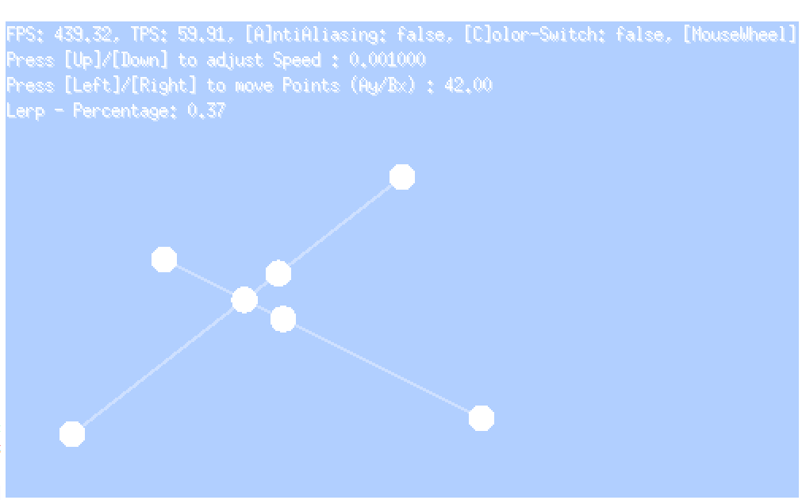

# selfdrivingcar
Go Project to learn Go and AI

# First impressions (after a few days)
## on Go
- [bad] where is my ternary operator? i need!
- [bad] why are unused variables are a problem -it is so annoying to remove them and adjust the imports accordingly
- [good] generics seems to work fine (slightly different but ok)
- [my bad] i have problems to structurize my project - where to put things

## on ebitengine
- overal, after some researching i'm having fun with it! And i will use it furthermore!
- but there are also strange feelings left behind:
- namings are often kinda weird:
   - ebiten.Wheel() is used to get the MouseWheel data 
   - ebiten.CursorPosition gives the Mouse coordinates 
- i think i would whish some more packages / organizations?  
- [my bad] took me a very long time to colorize some strokes and circles
- [my bad] text package seems to be very new - only avail in the latest trunk (little hard to find for me)

## App-1 (Lerp)

- Two crossing lines (you can move them by pressing the arrow keys)
- We use the lerp function to do linar interpolation and let the M and N points move along them (position can be seen on the screen text; in percent)
- Values between 0 and 1 are directly on the line. All other values are outside (extrapolated)
- Another goodie is to calculate the intersection of those lines
- [todo] Next step would be a collision detection where we only need to loop through our vertices and calculate those intersections

