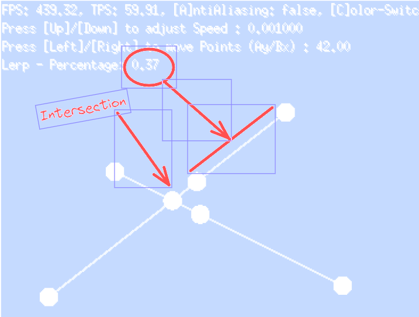

# selfdrivingcar
Go Project to learn Go and AI

# First impressions (after a few days)
## on Go
- where is my ternary operator? i need!
- why are unused variables are a problem -it is so annoying to remove them and adjust the imports accordingly
- generics seems to work which is also a must have to bend those many datatypes
- i have problems to structurize my project - where to put things

## on ebitengine
- strange feelings but also ok
- namings are kinda weird: ebiten.Wheel() is used to get the MouseWheel data .. directly in the main package?
- took me a very long time to colorize some strokes and circles
- text package seems to be very new - only avail in the latest trunk

## App-1 (Lerp)

